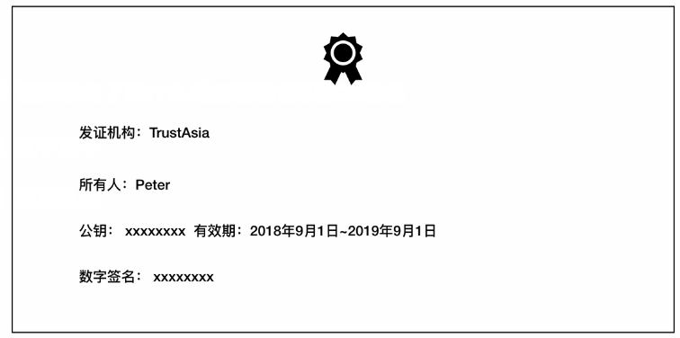

# https加密
使用http通信的时候安全性得不到保障, 在数据传输的过程中很可能被中间人抓包拿到, 那么数据就会被中间人窃取, 也可能对数据进行修改或者替换, 服务端无法判断数据就真是来自客户端
总结: http存下一下的问题:

1. 无法保证消息的准确性和完整性
2. 无法保证消息的保密性
3. 无法保证消息来源的可靠性

https就是为了解决上述问题应运而生的
## 基本概念
使用加密 数字证书 数组签名的技术实现

## 对称加密和非对称加密
### 对称加密(共享秘钥加密)
> 客户端和服务端共享一个密钥进行加密, 客户端和服务端约定好一个加密密钥, 客户端在发消息前用该密钥对消息进行加密, 发送到服务器后服务器再用这个密钥进行解密拿到消息

1. 对称加密的优点
对称加密解决了http消息的保密性的问题
2.  对称加密的缺点
    + 公用一个密钥导致密钥很容易泄露, 泄露风险高, 服务器也难以缺点消息的准确性
### 非对称加密(共有密钥加密)

> 客户端和服务器分别都拥有一个公钥和一个私钥, 公钥可以对外暴露, 而私钥只能自己可见
> 使用公钥加密的信息只能用对应的私钥进行解密, 反过来, 使用私钥加密的信息,只有公钥才能解开, 这样在客户端向服务器发送消息前, 先使用服务器的公钥进行加密, 服务器收到后再使用自己的私钥进行解密
1. 非对称加密的优点
  + 采用公钥和私钥的加密方式解决了http消息的保密性的问题
  + 因为公钥只能由对应的
2. 非对称加密的缺点
   + 非对称加密时需要使用到接收方的公匙对消息进行加密，但是公匙不是保密的，任何人都可以拿到，中间人也可以。那么中间人可以做两件事，第一件是中间人可以在客户端与服务器交换公匙的时候，将客户端的公匙替换成自己的。这样服务器拿到的公匙将不是客户端的，而是服务器的。服务器也无法判断公匙来源的正确性。第二件是中间人可以不替换公匙，但是他可以截获客户端发来的消息，然后篡改，然后用服务器的公匙加密再发往服务器，服务器将收到错误的消息。非
   
   + 对称加密的性能相对对称加密来说会慢上几倍甚至几百倍，比较消耗系统资源。正是因为如此，https将两种加密结合了起来。

# 数字证书与数字签名

为了解决非对称加密中的公钥来源的不安全性, 我们可以利用数字来源与数字签名来解决

# https加密过程

